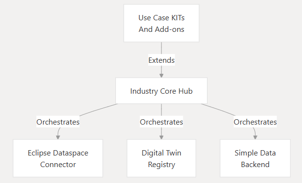
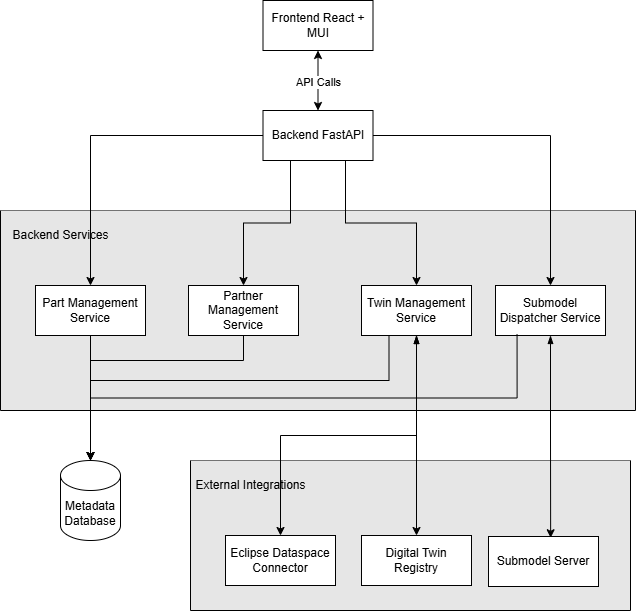

## 2 Architecture and constraints
The introduction presents the context where the Industry Core Hub will operate.
More detail about the relation of the Industry Core Hub and other components of Catena-X is shown below. As stated in the introduction, the Industry Core Hub will act as a middleware layer that orchestrates interactions between applications and Tractus-X components, enabling organizations to implement dataspace connectivity without deep expertise in each component.

The following figure shows more detail about the different calls between the components. These calls are made using the APIs offered by each of the components. 
The figure also presents the relations of the ICH with the use cases and users. Users will interact with the ICH by means of a user interface (frontend)

### Architectural Overview- ICH components
The High-Level System Architecture for the Industry Core Hub is presented next.

The main components of the ICH are the ICH Backend and the ICH Frontend. 
The Backend is written in Python and offers a simplify FastAPI that enables easy integration with external components such as the Eclipse Dataspace Connector (EDC) and the industry components (DTR). The API offered is consumed by the users through frontend. Use cases can also consume that FastAPIdirectly.
The Backend component includes two SDK modules provided by Tractus-X ([Tractus_X SDK](https://github.com/eclipse-tractusx/tractusx-sdk)). The DataSpace SDK module enables interactions with the EDC and the Industry SDK module with the DTR. 

The Frontend component is built on React.js and offers an interface where users can upload information about their parts and register them in the dataspace.

In addition, the ICH includes a metadata database where essential information for the parts, assets, twins and contracts is registered ([ICH Database section](https://github.com/flarrinaga/industry-core-hub/blob/development/docs/architecture/2-architecture-constraints.md#ich-database))

The following image shows how the number of operations a use case needs to perfom through the ICH is reduced in comparison to use cases accessing directly to the data space components or only using the SDK libraries.
Changes in any of the components only affect libraries. This implies that use cases using the ICH will not be affected by those changes while use cases accessing directly will need to be updated.  

### ICH Backend Component

tbc.

### ICH Frontend Component

tbc.

### ICH Database

The ICH Database is an relational database deployed in PostgreSQL that can be query using SQL.
The database diagram is shown next.

 
The database tables are documented in models.py (ichub-backend/models/metadata_database/models.py)

### Constraints
- each Data partner needs to run its own ICH in his environment. The ICH is not a central component.
- Data Provider must register its parts in the ICH and provide/register its twins and assets through the ICH Backend.
- To make requests to the ICH there is an API and also can be consume through the interface provided by the Frontend.

### Architecture Constraints
- Developed under an open-source license and all used frameworks and
    libraries suites to this license.

- Must be compliant and fulfill the Catena-X Guidelines.

### NOTICE

This work is licensed under the [CC-BY-4.0](https://creativecommons.org/licenses/by/4.0/legalcode).

- SPDX-License-Identifier: CC-BY-4.0
- SPDX-FileCopyrightText: 2025 Contributors to the Eclipse Foundation
- Source URL: https://github.com/eclipse-tractusx/industry-core-hub
