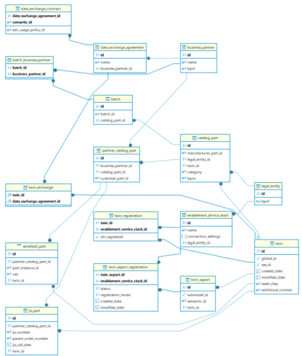

## 2 Architecture and constraints
The introduction presents the context where the Industry Core Hub will operate.
More detail about the relation of the Industry Core Hub and other components of Catena-X is shown below. As stated in the introduction, the Industry Core Hub will act as a middleware layer that orchestrates interactions between applications and Tractus-X components, enabling organizations to implement dataspace connectivity without deep expertise in each component.

The following figure shows more detail about the different calls between the components. These calls are made using the APIs offered by each of the components. 
The figure also presents the relations of the ICH with the use cases and users. Users will interact with the ICH by means of a user interface (frontend)

### Architectural Overview- ICH components
The High-Level System Architecture for the Industry Core Hub is presented next.

The main components of the ICH are the ICH Backend and the ICH Frontend. 
The Backend is written in Python and offers a simplify FastAPI and Backend Services that enable easy integration with a database and external components such as the Eclipse Dataspace Connector (EDC) and the industry components (DTR). The API offered is consumed by the users through the frontend. Use cases can also consume that FastAPI directly.
The Backend component includes two SDK modules provided by Tractus-X ([Tractus_X SDK](https://github.com/eclipse-tractusx/tractusx-sdk)). The DataSpace SDK module enables interactions with the EDC and the Industry SDK module with the DTR and the Submodel Server. 

The Frontend component is built on React.js and offers an interface where users can upload information about their parts and register them in the dataspace.

In addition, the ICH includes a metadata database where essential information for the parts, assets, twins and contracts is registered ([ICH Database section](https://github.com/flarrinaga/industry-core-hub/blob/development/docs/architecture/2-architecture-constraints.md#ich-database))

The following image shows how the number of operations a use case needs to perfom through the ICH is reduced in comparison to use cases accessing directly to the data space components or only using the SDK libraries.
Changes in any of the components only affect libraries. This implies that use cases using the ICH will not be affected by those changes while use cases accessing directly will need to be updated.  

### ICH Backend Component

The Industry Core Hub backend follows a service-oriented architecture with clear separation of concerns. It is built using FastAPI and implements a layered architecture with controllers, services, and repositories.

The backend implements four core services that encapsulate business logic:
#### Part Management Service
The Part Management Service handles catalog parts, serialized parts, JIS parts, and batches. It provides functionality to:

- Create and retrieve catalog parts
- Manage part relationships
- Handle part mappings between partners
  
Catalog parts are identified by manufacturer ID and manufacturer part ID, representing the foundational part entities in the system.
#### Partner Management Service
The Partner Management Service manages business partners and data exchange agreements between partners. It provides functionality to:

- Create and list business partners
- Retrieve business partner details
- Manage data exchange agreements
- Configure contract terms for data sharing

Business partners are identified by their Business Partner Number (BPNL) in the Catena-X ecosystem.
#### Twin Management Service
The Twin Management Service handles digital twins and their aspects. It integrates with the Digital Twin Registry (DTR) and provides functionality to:

- Create and manage digital twins
- Associate twins with parts
- Define and update twin aspects

Digital twins are central to the Catena-X ecosystem, providing digital representations of physical parts.
#### Submodel Dispatcher Service
This implementation just checks if the twin where the submodel belongs to is shared with the business partner via any data exchange agreement. For this version it does not check the semantic ID of the sumodel. This could later be done when the ICH manages the submodel contracts behind the data exchange agreements. 
#### FastAPI
The backend exposes a RESTful API with endpoints organized by service domain:

| Service Domain      | Endpoint Pattern       | Description                                                                                                |
|---------------------|------------------------|------------------------------------------------------------------------------------------------------------|
| Part Management     | /part-management/*     | Endpoints for managing catalog parts and their instances                                                   |
| Partner Management  | /partner-management/*  | Endpoints for managing business partners and data exchange agreements                                      |
| Twin Management     | /twin-management/*     | Endpoints for managing digital twins                                                                       |
| Submodel Dispatcher | /submodel-dispatcher/* | Internal API called by EDC Data Planes in order the deliver data of of the internall used Submodel Service |

### ICH Frontend Component

The Industry Core Hub frontend is built using React with Material UI (MUI) and the Catena-X Portal shared component library. It implements a component-based architecture focused on catalog and product management. The high level architecture is shown in the following figure.

The architecture has been structured in layers. The Entry Points layer holds the components that start the application and upload the rest of components in other layers. 
The Styling layer presents the themes and scss styles used in the application. The key styling features are:
- Custom theme defined in theme.ts
- Global styles in main.scss
- Component-specific styling in SCSS files
- Integration with Catena-X Portal design system

The pages and components developed in the project are allocated in the Pages and the Core Components layers.

#### Page Layer 
The frontend consists of two primary page components that serve as containers for other UI elements.
- ProductsList Page: displays a grid of product cards with pagination and provides navigation capabilities via the sidebar. Its key features are:
  - Grid layout of products using ProductCard components
  - Collapsible sidebar navigation
  - Share functionality via ShareDialog
  - Pagination using MUI TablePagination
- ProductDetails Page: displays detailed information about a specific product and offers various actions.
  - Product status indication 
  - Product information display
  - Action buttons for accessing different product aspects
  - JSON data viewing via JsonViewerDialog
  - Sharing options via ShareDialog and ShareDropdown

#### Core Components Layer

This layer holds the following components:
- ProductCard: A card component that displays basic product information and provides click and share actions. Its key features are:
  - Displays product name, class, and status
  - Click handler for navigation to details
  - Share button for opening ShareDialog
    
- ShareDialog: A dialog component used for sharing product information. Its key features are:
  - Displays sharing options for a product
  - Used in both ProductsList and ProductsDetails pages

- JsonViewerDialog: A dialog component that renders structured JSON data in a readable format. Its key features are:
  - Displays product data in JSON format
  - Used primarily in ProductsDetails for viewing the Digital Product Passport

- Sidebar: A collapsible navigation sidebar component. Its key features are:
  - Provides navigation between different application sections
  - Can be toggled open/closed
  - Adjusts main content layout when open

- ProductData: It is features specific component that displays detailed information about a product.
- ProductButton: It is features specific component. It is a specialized button component for product-related actions.
- ShareDropdown: It is features specific component. A dropdown menu with sharing options.
- InstanceProductsTable: It is features specific component. A table component that displays product instances.

#### Integration with UI Frameworks

The pages and components in the ICH Frontend use components provided by MUI and Catena-X frameworks.

The Material UI (MUI) Framework provides core UI components like Grid, Typography, IconButton, Drawer and AppBar.
The Catena-X Portal Shared Components provide specialized components like StatusTag, Button, and Icon.

This integration ensures consistency with the broader Catena-X ecosystem while leveraging the robust component library of Material UI.

### ICH Database

The design followed to model the database with the information required by the ICH is shown in the following figure.

From that design the Database repository was created. The ICH Database is an relational database deployed in PostgreSQL that can be query using SQL.
The database diagram is shown next.

 
The database tables are documented in models.py [(ichub-backend/models/metadata_database/models.py)](https://github.com/flarrinaga/industry-core-hub/blob/development/ichub-backend/models/metadata_database/models.py)

### Constraints
- each Data partner needs to run its own ICH in his environment. The ICH is not a central component.
- Data Provider must register its parts in the ICH and provide/register its twins and assets through the ICH Backend.
- To make requests to the ICH there is an API and also can be consume through the interface provided by the Frontend.

### Architecture Constraints
- Developed under an open-source license and all used frameworks and
    libraries suites to this license.

- Must be compliant and fulfill the Catena-X Guidelines.

### NOTICE

This work is licensed under the [CC-BY-4.0](https://creativecommons.org/licenses/by/4.0/legalcode).

- SPDX-License-Identifier: CC-BY-4.0
- SPDX-FileCopyrightText: 2025 Contributors to the Eclipse Foundation
- Source URL: https://github.com/eclipse-tractusx/industry-core-hub
