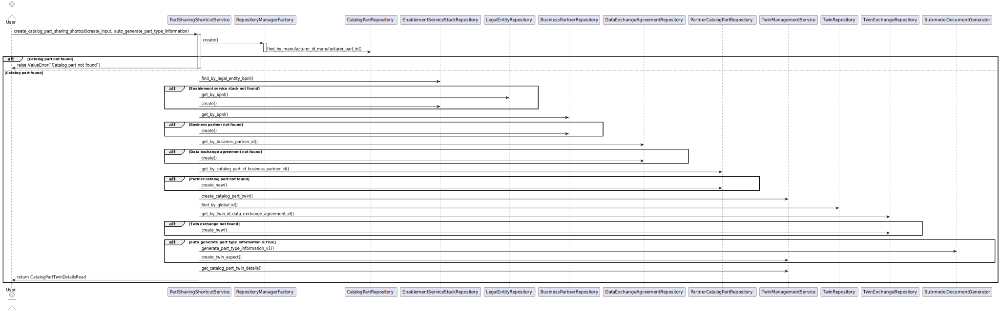
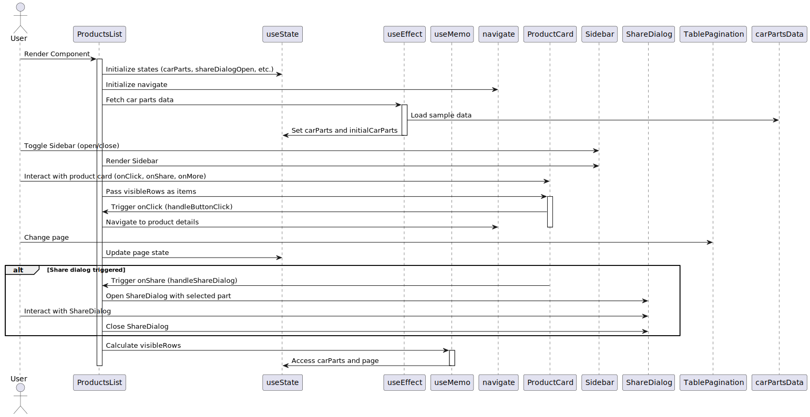
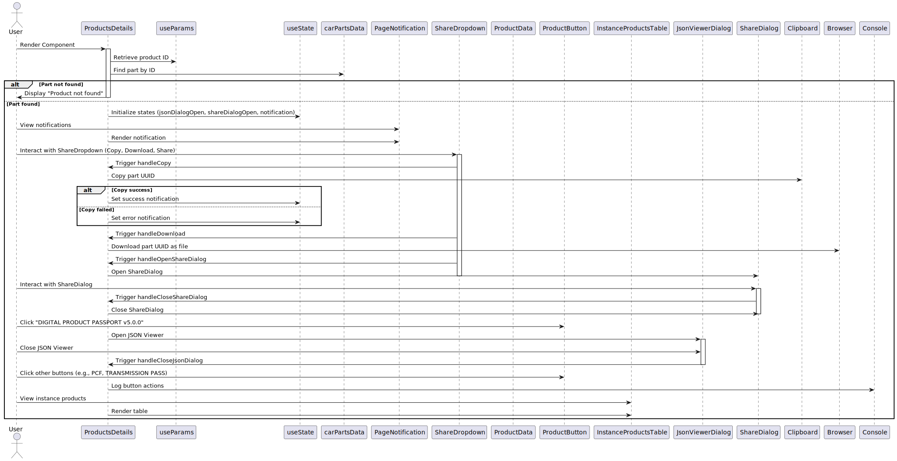

## 4 Runtime-view
This document presents the runtime view of the Industrial Core Hub. For this version, the process documented in this section is mainly based in the procedure followed in the ICH backend component. 
The document presents sequence diagram and the steps followed to retrieve a catalog, the enablement services, the business partner, the agreement and the twin. It also shows the step to generate and upload the submodel document related to a part type. 

### Actors 
For this version, We have simplify the actors involved considering only the User. The user is the actor that interacts with the ICH through the FastAPI offered by the ICH backend component.
In future versions this user will be the ICH frontend or any component of a use case that consumes the FastAPI.

| Actor         | 	Description                                                                                              | Examples                                                                 |
|---------------|------------------------------------------------------------------------------------------------------------|--------------------------------------------------------------------------|
| User          | The user is any actor that interacts with the ICH through the FastAPI offered by the ICH backend component.| The ICH Frontend or any application consuming the FastAPI.               |

The interactions are shown in the diagrams below.
For the purpose of simplifying, the interactions via ICH Frontend are not shown completely.

### Backend Interaction diagrams
The following figure presents the process followed at ICH Backend level.

The process consists of 8 steps:
- Step 1: Retrieves the catalog part entity according to the catalog part data (manufacturer_id, manufacturer_part_id)
- Step 2: Retrieves the enablement service stack entity from the DB according to the given name. If it does not exist, the application creates it with the default name
- Step 3: Retrieves the business partner entity according to the business_partner_name. If it is not there, the application creates it
- Step 4: Retrieves the first data exchange agreement entity for the business partner. If it is not there, it creates one with the default name
- Step 5: Gets the partner's catalog part entity from the DB according to the catalog part and business partner. If it is not there, it creates one with a generated customer part id
- Step 6: Lets the Twin Management Service create the catalog part twin. Then retrieves the twin from the DB
- Step 7: Checks if there is already a twin exchange entity for the twin and data exchange agreement and creates it otherwise
- Step 8: If specified, the step generates and uploads the part type information submodel document

The following diagrams present a closer view of Steps1-3, Step4-6 and Step7-8

#### Steps1-3

.svg)

#### Steps4-6

.svg)

#### Steps7-8

.svg)

### Frontend Interaction diagrams
The following figure presents the process followed at ICH Frontend level. The following images present the sequence followed in the two main pages of the component (ProductLists and ProductDetails)

### Frontend-Backend Integration diagrams
TBC
  
### NOTICE

This work is licensed under the [CC-BY-4.0](https://creativecommons.org/licenses/by/4.0/legalcode).

- SPDX-License-Identifier: CC-BY-4.0
- SPDX-FileCopyrightText: 2025 Contributors to the Eclipse Foundation
- Source URL: https://github.com/eclipse-tractusx/industry-core-hub
